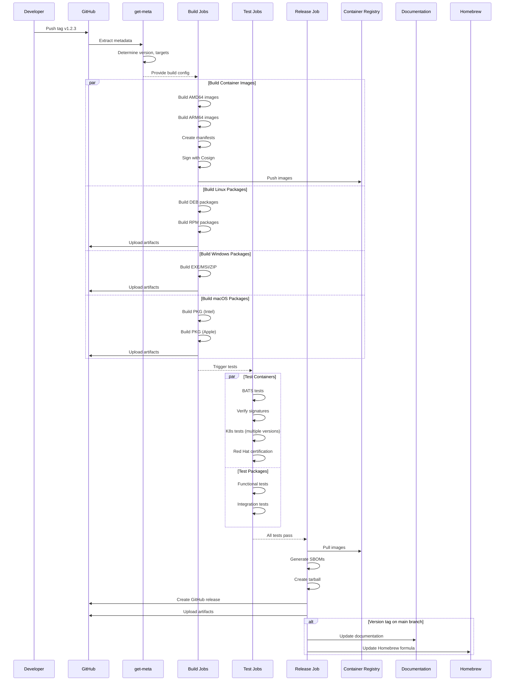
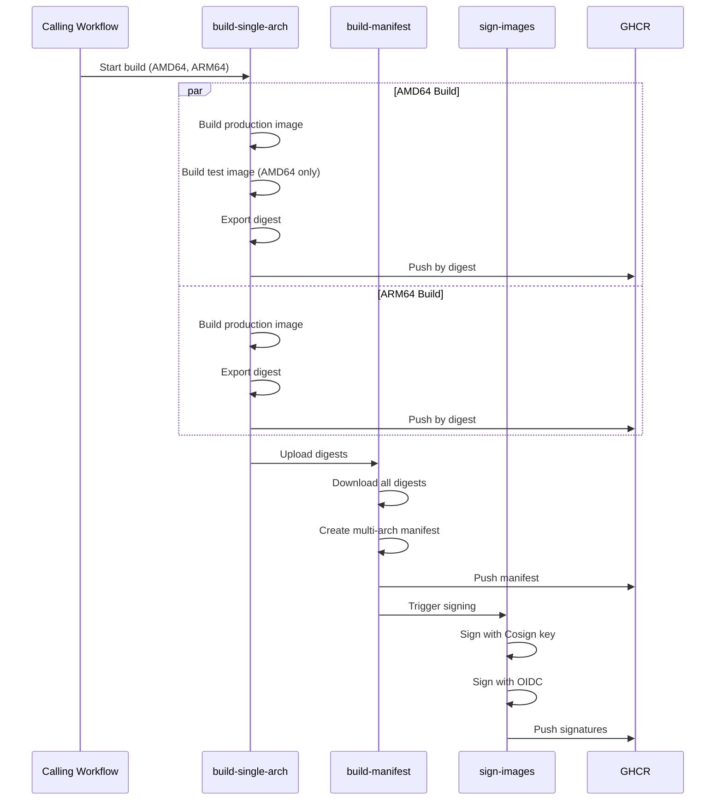
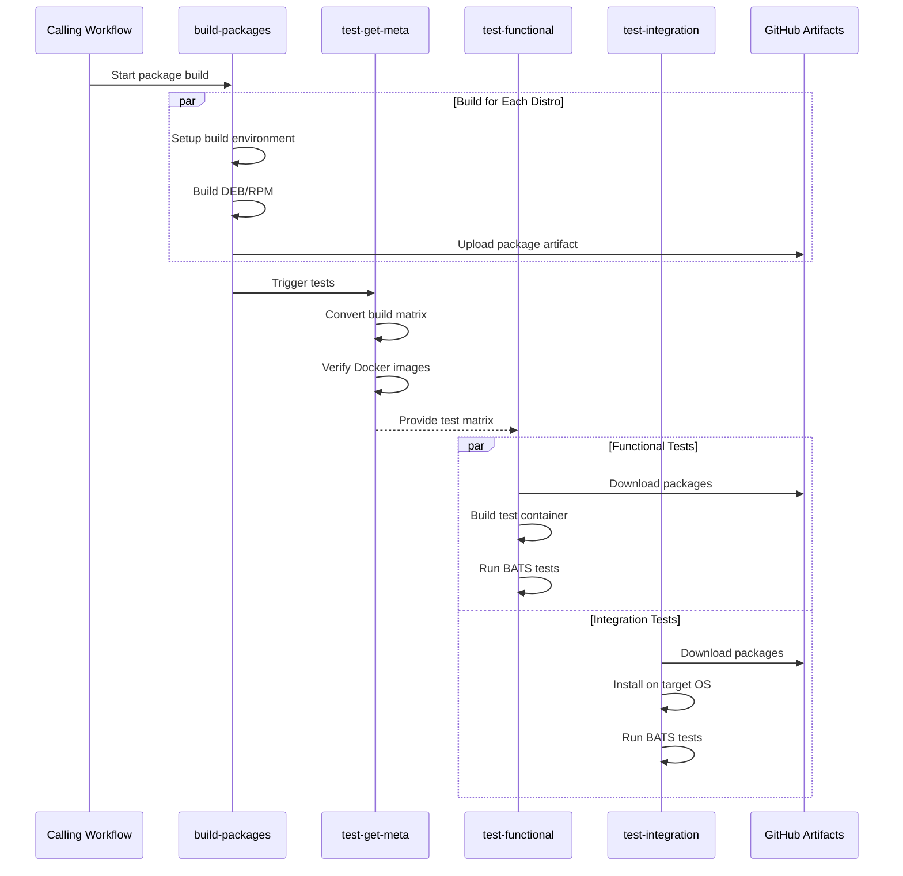
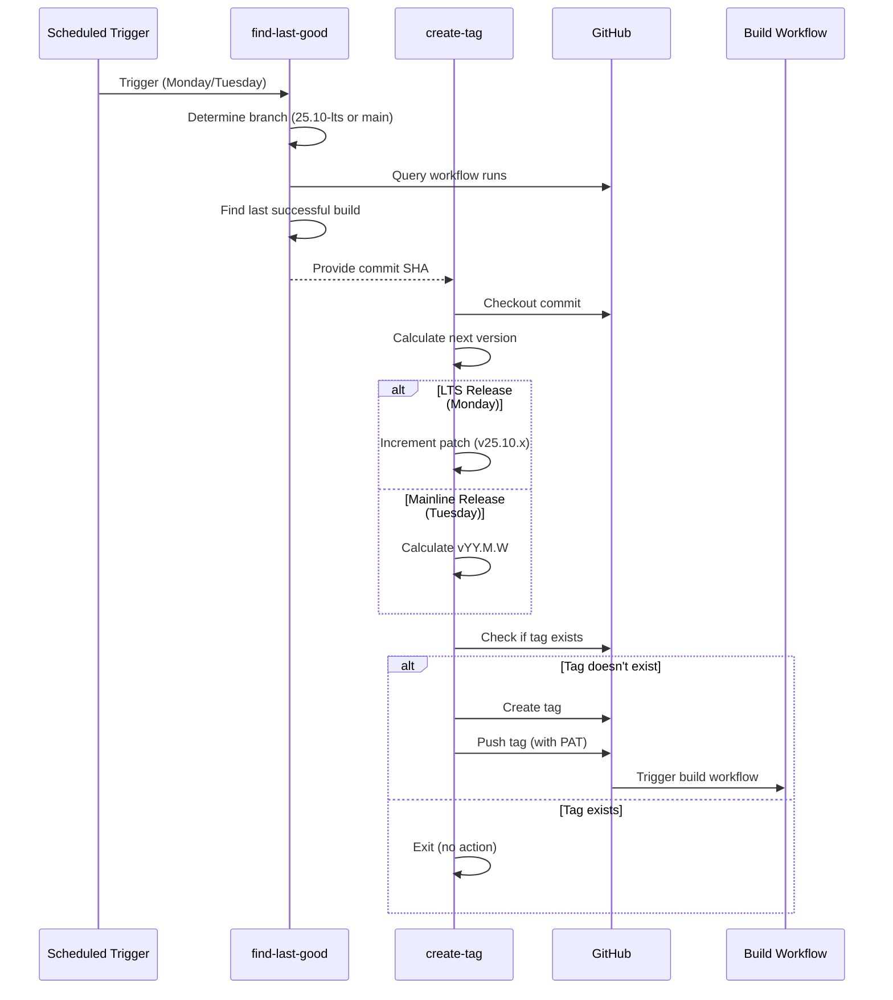
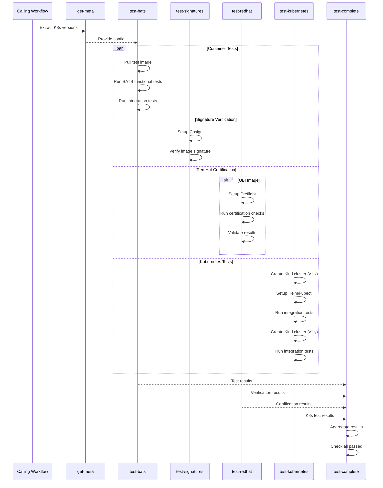
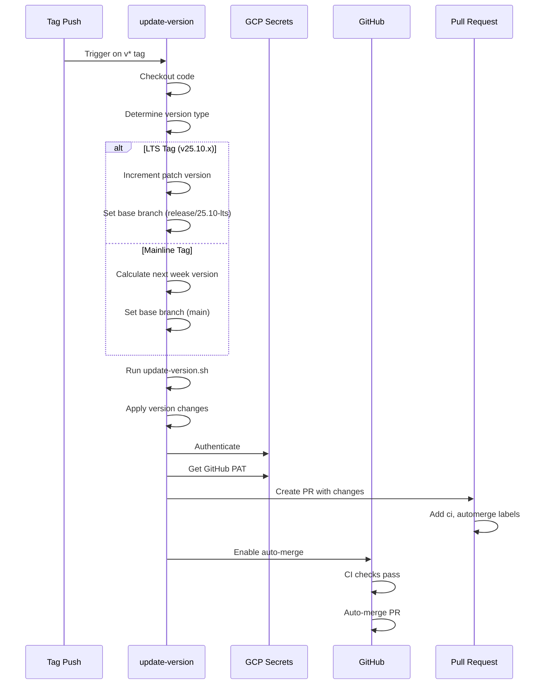

# GitHub Actions CI/CD Documentation

This directory contains the GitHub Actions workflows and reusable actions for the Agent project. The CI/CD pipeline automates building, testing, packaging, and releasing the agent across multiple platforms.

[](https://coveralls.io/github/telemetryforge/agent)

## Table of Contents

- [GitHub Actions CI/CD Documentation](#github-actions-cicd-documentation)
  - [Table of Contents](#table-of-contents)
  - [Overview](#overview)
  - [Workflows](#workflows)
    - [Build and Test](#build-and-test)
    - [Unit Tests](#unit-tests)
    - [Lint](#lint)
    - [Lint Packages](#lint-packages)
    - [Test Specific Versions](#test-specific-versions)
    - [Auto Release](#auto-release)
    - [Update Version](#update-version)
  - [Reusable Workflows](#reusable-workflows)
    - [Build Containers](#build-containers)
    - [Build Linux Packages](#build-linux-packages)
    - [Build Windows Packages](#build-windows-packages)
    - [Build macOS Packages](#build-macos-packages)
    - [Test Containers](#test-containers)
    - [Test Containers on Kubernetes](#test-containers-on-kubernetes)
    - [Test Packages](#test-packages)
    - [Publish Release Images](#publish-release-images)
  - [Composite Actions](#composite-actions)
    - [Get Package Name](#get-package-name)
  - [Workflow Diagrams](#workflow-diagrams)
    - [Main Build and Release Flow](#main-build-and-release-flow)
    - [Container Build Flow](#container-build-flow)
    - [Package Build and Test Flow](#package-build-and-test-flow)
    - [Auto Release Flow](#auto-release-flow)
    - [Test Container Flow](#test-container-flow)
    - [Version Update Flow](#version-update-flow)
  - [Configuration Files](#configuration-files)
    - [build-config.json](#build-configjson)
    - [Environment Variables](#environment-variables)
  - [Runner Labels](#runner-labels)
  - [Secrets](#secrets)
  - [Best Practices](#best-practices)
  - [Troubleshooting](#troubleshooting)
    - [Build Failures](#build-failures)
    - [Test Failures](#test-failures)
    - [Release Issues](#release-issues)
  - [Contributing](#contributing)
  - [Support](#support)

## Overview

The CI/CD pipeline is designed to:

1. **Build** - Create container images and packages for multiple platforms (Linux, Windows, macOS)
2. **Test** - Run unit tests, integration tests, and functional tests
3. **Lint** - Validate code quality, Dockerfiles, shell scripts, and GitHub Actions
4. **Package** - Generate distribution packages (DEB, RPM, MSI, PKG)
5. **Release** - Publish releases with signed artifacts and container images
6. **Automate** - Automatically create releases on a schedule

## Workflows

### Build and Test

**File:** [`.github/workflows/build.yaml`](./build.yaml)

**Triggers:**

- Pull requests (opened, synchronize, reopened, labeled)
- Push to `main` and `release/**` branches
- Push of version tags (`v*`)
- Manual workflow dispatch

**Purpose:** Main CI/CD workflow that orchestrates building, testing, and releasing the Agent.

**Jobs:**

1. **get-meta** - Extracts metadata including version, build type, and target platforms
2. **build-image** - Builds multi-architecture container images (UBI and Debian-based)
3. **build-linux** - Builds Linux packages (DEB, RPM) for various distributions
4. **build-windows** - Builds Windows packages (EXE, MSI, ZIP)
5. **build-macos** - Builds macOS packages (PKG) for Intel and Apple Silicon
6. **copy-common-images** - Promotes release images to standard locations
7. **test-containers** - Runs container tests including BATS and Kubernetes tests
8. **test-packages** - Tests Linux packages on target distributions
9. **tests-complete** - Aggregates test results
10. **release** - Creates GitHub releases with artifacts and SBOMs
11. **update-docs** - Updates documentation with new version mappings
12. **update-homebrew** - Updates Homebrew formula for macOS

**Key Features:**

- Conditional execution based on PR labels (`build-packages`, `build-linux`, `build-windows`, `build-macos`, `build-self-hosted`)
- Support for self-hosted runners
- Multi-architecture builds (AMD64, ARM64)
- Signed container images using Cosign
- SBOM generation for containers
- Automated release creation for version tags

**Outputs:**

- Container images pushed to `ghcr.io/telemetryforge/agent`
- Linux packages (DEB, RPM)
- Windows packages (EXE, MSI, ZIP)
- macOS packages (PKG)
- GitHub releases with all artifacts

### Unit Tests

**File:** [`.github/workflows/unit-tests.yaml`](./unit-tests.yaml)

**Triggers:**

- Pull requests to `main` and `release/**` branches (when source code changes)
- Manual workflow dispatch

**Purpose:** Runs comprehensive unit tests with sanitizers and generates code coverage reports.

**Jobs:**

1. **linux-unit-tests** - Runs unit tests with different sanitizers (address, undefined, memory, thread)

**Key Features:**

- Multiple sanitizer configurations (address, undefined, memory, thread)
- Code coverage reporting using gcovr
- Coverage reports in multiple formats (HTML, XML, JSON)
- Runs on Namespace profile runners (4 vCPU, 8GB RAM)
- 15-minute timeout for test execution
- Parallel test execution with ctest

**Outputs:**

- Coverage reports (HTML, XML, JSON)
- Test results

### Lint

**File:** [`.github/workflows/lint.yaml`](./lint.yaml)

**Triggers:**

- Pull requests (opened, edited, synchronize, reopened)
- Manual workflow dispatch

**Purpose:** Validates code quality and style across multiple dimensions.

**Jobs:**

1. **hadolint-pr** - Lints Dockerfiles using Hadolint
2. **shellcheck-pr** - Lints shell scripts using Shellcheck
3. **actionlint-pr** - Lints GitHub Actions workflows using Actionlint
4. **prchecker-lint** - Validates PR title format (conventional commits)

**Key Features:**

- Dockerfile linting with Hadolint
- Shell script linting with Shellcheck (excludes vendored code)
- GitHub Actions workflow validation
- Conventional commit enforcement for PR titles
- Skips validation for Dependabot PRs

### Lint Packages

**File:** [`.github/workflows/lint-packages.yaml`](./lint-packages.yaml)

**Triggers:**

- Pull requests affecting packaging files
- Manual workflow dispatch

**Purpose:** Validates Debian package quality using Lintian.

**Jobs:**

1. **build-packages-for-ubuntu** - Builds test packages for Ubuntu 24.04
2. **lintian-pr** - Runs Lintian checks on generated DEB packages

**Key Features:**

- Builds Ubuntu packages for testing
- Runs Lintian with custom configuration
- Lists package contents and control files
- Validates package dependencies

### Test Specific Versions

**File:** [`.github/workflows/test.yaml`](./test.yaml)

**Triggers:**

- Manual workflow dispatch only

**Purpose:** Allows testing specific container image versions on-demand.

**Inputs:**

- `image` - Full image name (default: `ghcr.io/telemetryforge/agent`)
- `image-tag` - Image tag to test (required)
- `ref` - Repository reference to use (default: `main`)

**Jobs:**

1. **get-meta** - Extracts Kubernetes versions for testing
2. **test-containers** - Runs container tests using the reusable workflow

**Use Case:** Testing released versions or specific builds without rebuilding.

### Auto Release

**File:** [`.github/workflows/cron-auto-release.yaml`](./cron-auto-release.yaml)

**Triggers:**

- Schedule: Mondays at 10:00 UTC (25.10 LTS releases)
- Schedule: Tuesdays at 10:00 UTC (latest releases)
- Manual workflow dispatch

**Purpose:** Automatically creates release tags based on the last successful build.

**Jobs:**

1. **find-last-good** - Finds the last successful build commit
2. **create-tag** - Creates and pushes a new version tag

**Key Features:**

- Automatic tag creation based on schedule
- Different versioning for LTS (25.10.x) and mainline (vYY.M.W)
- Finds last successful "Build and test" workflow run
- Validates tag doesn't already exist
- Uses PAT to trigger downstream workflows
- Dry-run support for testing

**Tag Formats:**

- LTS: `v25.10.x` (incremental patch version)
- Mainline: `vYY.M.W` (year.month.week)

### Update Version

**File:** [`.github/workflows/update-version.yaml`](./update-version.yaml)

**Triggers:**

- Push of version tags (`v*`)
- Manual workflow dispatch

**Purpose:** Updates version numbers in the codebase after a release.

**Jobs:**

1. **update-version** - Updates version to next expected version and creates PR

**Key Features:**

- Automatic version increment for LTS releases
- Date-based versioning for mainline
- Creates PR with version updates
- Auto-merge enabled for version PRs
- Supports dry-run mode

**Version Logic:**

- LTS tags (`v25.10.x`): Increments patch version
- Mainline: Calculates next week's version (`vYY.M.W`)

## Reusable Workflows

### Build Containers

**File:** [`.github/workflows/call-build-containers.yaml`](./call-build-containers.yaml)

**Purpose:** Builds multi-architecture container images with signing.

**Inputs:**

- `version` - Version to build
- `ref` - Git reference to checkout
- `image-base` - Base image name
- `definition` - Dockerfile to use
- `dockerhub-username` - Docker Hub username for pulls
- `amd-runner-label` - Runner label for AMD64 builds
- `arm-runner-label` - Runner label for ARM64 builds

**Secrets:**

- `cosign_private_key` - Cosign signing key
- `cosign_private_key_password` - Cosign key password
- `dockerhub-token` - Docker Hub token

**Jobs:**

1. **build-single-arch-container-images** - Builds images for each architecture/target
2. **build-container-image-manifest** - Creates multi-arch manifests
3. **build-container-images-sign** - Signs images with Cosign

**Outputs:**

- `tag` - Full image name and tag
- `image` - Image name
- `version` - Container version

**Key Features:**

- Multi-architecture support (AMD64, ARM64)
- Multiple targets (production, test)
- Image signing with Cosign (key-based and OIDC)
- Digest-based manifest creation
- Test image for BATS tests (AMD64 only)

### Build Linux Packages

**File:** [`.github/workflows/call-build-linux-packages.yaml`](./call-build-linux-packages.yaml)

**Purpose:** Builds Linux packages (DEB, RPM) for multiple distributions.

**Inputs:**

- `target-matrix` - JSON array of target distributions
- `version` - Version to build
- `ref` - Git reference to checkout
- `nightly-build-info` - Nightly build information
- `dockerhub-username` - Docker Hub username
- `amd-runner-label` - Runner label for AMD64
- `arm-runner-label` - Runner label for ARM64
- `large-amd-runner-label` - Runner label for resource-intensive builds

**Secrets:**

- `gpg_private_key` - GPG signing key
- `gpg_private_key_password` - GPG key password
- `dockerhub-token` - Docker Hub token

**Jobs:**

1. **build-packages** - Builds packages for each distribution

**Supported Distributions:**

- AlmaLinux (8, 9, 10)
- Amazon Linux (2023)
- CentOS (6, 7, 8, 9, 10)
- Mariner (2)
- Rocky Linux (8, 9, 10)
- Debian (Buster, Bullseye, Bookworm, Trixie)
- Ubuntu (20.04, 22.04, 24.04)
- SUSE (15)

**Key Features:**

- Multi-distribution support
- ARM64 and AMD64 builds
- Package dependency listing
- Artifact upload per distribution
- QEMU support for cross-compilation

### Build Windows Packages

**File:** [`.github/workflows/call-build-windows-packages.yaml`](./call-build-windows-packages.yaml)

**Purpose:** Builds Windows packages (EXE, MSI, ZIP).

**Inputs:**

- `version` - Version to build
- `ref` - Git reference to checkout
- `nightly-build-info` - Nightly build information

**Jobs:**

1. **call-build-windows-package** - Builds Windows packages

**Key Features:**

- Windows Server 2025 runner
- vcpkg for dependency management
- Static linking
- CMake 3.31.6
- NSIS for installer creation
- Multiple package formats (EXE, MSI, ZIP)

**Dependencies:**

- OpenSSL (via vcpkg)
- libyaml (via vcpkg)
- libgit2 (via vcpkg)
- WinFlexBison

### Build macOS Packages

**File:** [`.github/workflows/call-build-macos-packages.yaml`](./call-build-macos-packages.yaml)

**Purpose:** Builds macOS packages (PKG) for Intel and Apple Silicon.

**Inputs:**

- `version` - Version to build
- `ref` - Git reference to checkout
- `nightly-build-info` - Nightly build information

**Jobs:**

1. **call-build-macos-package** - Builds macOS packages

**Platforms:**

- macOS Intel (macos-15-intel)
- macOS Apple Silicon (macos-15)

**Key Features:**

- Homebrew for dependencies
- Static linking (removes dynamic libraries)
- CMake 3.31.6
- ProductBuild packaging
- Linkage verification
- Configuration validation

**Dependencies:**

- bison, flex, gnu-sed
- libyaml, openssl, libgit2
- cyrus-sasl, rocksdb

### Test Containers

**File:** [`.github/workflows/call-test-containers.yaml`](./call-test-containers.yaml)

**Purpose:** Comprehensive container testing including BATS, Kubernetes, and certification.

**Inputs:**

- `ref` - Repository reference
- `image` - Full image name
- `image-tag` - Image tag to test

**Secrets:**

- `github-token` - GitHub token for registry access

**Jobs:**

1. **get-meta** - Extracts Kubernetes versions for testing
2. **test-bats-container** - Runs BATS functional tests
3. **test-verify-signatures** - Verifies image signatures with Cosign
4. **test-redhat-certification** - Tests UBI images for Red Hat certification
5. **test-kubernetes** - Runs tests on multiple Kubernetes versions
6. **test-complete** - Aggregates test results

**Key Features:**

- BATS functional tests in container
- Container integration tests with Rush parallelism
- Cosign signature verification
- Red Hat Preflight certification checks
- Multi-version Kubernetes testing
- Conditional Red Hat tests (UBI images only)

### Test Containers on Kubernetes

**File:** [`.github/workflows/call-test-containers-k8s.yaml`](./call-test-containers-k8s.yaml)

**Purpose:** Tests container images on Kubernetes clusters.

**Inputs:**

- `ref` - Repository reference
- `image` - Full image name
- `image-tag` - Image tag to test
- `kind-version` - Kubernetes version to test

**Secrets:**

- `github-token` - GitHub token for registry access

**Jobs:**

1. **test-containers** - Runs Kubernetes integration tests

**Key Features:**

- Kind cluster creation
- Helm and kubectl setup
- BATS integration tests
- Rush for parallel execution
- Debug output on failure
- Multi-version Kubernetes support

### Test Packages

**File:** [`.github/workflows/call-test-packages.yaml`](./call-test-packages.yaml)

**Purpose:** Tests Linux packages on target distributions.

**Inputs:**

- `build-matrix` - JSON array of build targets
- `version` - Version to test
- `ref` - Repository reference
- `dockerhub-username` - Docker Hub username
- `amd-runner-label` - Runner label

**Secrets:**

- `github-token` - GitHub token
- `dockerhub-token` - Docker Hub token

**Jobs:**

1. **call-test-packages-get-meta** - Converts build matrix to test matrix
2. **call-test-packages-functional** - Runs functional tests in containers
3. **call-test-packages-integration** - Runs integration tests on actual OS

**Key Features:**

- Automatic test target generation
- Docker image availability verification
- Functional tests using Dokken containers
- Integration tests on Ubuntu and Windows
- BATS test execution
- Package installation verification

**Test Types:**

- Functional: Tests in Dokken containers
- Integration: Tests on actual OS (Ubuntu, Windows)

### Publish Release Images

**File:** [`.github/workflows/call-publish-release-images.yaml`](./call-publish-release-images.yaml)

**Purpose:** Promotes release images to production registries.

**Inputs:**

- `version` - Container tag to promote

**Secrets:**

- `github-token` - GitHub token

**Jobs:**

1. **promote-ghcr-images** - Promotes images to top-level GHCR registries
2. **promote-redhat-catalog-images** - Submits UBI images to Red Hat catalog

**Key Features:**

- UBI image promotion to `ghcr.io/telemetryforge/agent:version`
- Debian image promotion to `ghcr.io/telemetryforge/agent:version-slim`
- Red Hat certification submission
- Skopeo for multi-arch image copying
- Preflight validation before submission

## Composite Actions

### Get Package Name

**File:** [`.github/actions/get-package-name/action.yml`](.github/actions/get-package-name/action.yml)

**Purpose:** Converts distribution names to standardized package artifact names.

**Inputs:**

- `distro` - Distribution name (e.g., `centos/7`, `ubuntu/24.04`)

**Outputs:**

- `package-name` - Formatted package name (e.g., `package-centos-7`, `package-ubuntu-24.04`)

**Usage:**

```yaml
- name: Get package name
  uses: ./.github/actions/get-package-name
  id: get_package_name
  with:
    distro: "ubuntu/24.04"

- name: Use package name
  run: echo "${{ steps.get_package_name.outputs.package-name }}"
```

## Workflow Diagrams

### Main Build and Release Flow



### Container Build Flow



### Package Build and Test Flow



### Auto Release Flow



### Test Container Flow



### Version Update Flow



## Configuration Files

### build-config.json

**File:** [`build-config.json`](../build-config.json)

Contains build configuration including:

- `linux_targets` - Full list of Linux distributions for PR builds
- `release.linux_targets` - Reduced list for main/release builds
- `kind_versions` - Kubernetes versions for testing

Example structure:

```json
{
  "linux_targets": [
    "almalinux/8",
    "ubuntu/24.04",
    "debian/bookworm"
  ],
  "release": {
    "linux_targets": [
      "ubuntu/24.04",
      "ubuntu/24.04.arm64v8"
    ]
  },
  "kind_versions": [
    "v1.31.12",
    "v1.32.8"
  ]
}
```

### Environment Variables

Common environment variables used across workflows:

- `TELEMETRY_FORGE_AGENT_VERSION` - Version being built
- `TELEMETRY_FORGE_AGENT_IMAGE` - Container image name
- `TELEMETRY_FORGE_AGENT_TAG` - Container image tag
- `FLUENT_BIT_BINARY` - Path to Fluent Bit binary for testing
- `FLB_NIGHTLY_BUILD` - Nightly build information
- `VCPKG_BUILD_TYPE` - vcpkg build type (Windows)
- `KIND_VERSION` - Kubernetes version for testing

## Runner Labels

The workflows support different runner types:

- `ubuntu-latest` - Standard GitHub-hosted runners
- `namespace-profile-ubuntu-latest` - Namespace runners (4 vCPU, 8GB RAM)
- `namespace-profile-ubuntu-latest-4cpu-16gb` - Larger Namespace runners
- `namespace-profile-ubuntu-latest-arm` - ARM64 Namespace runners
- `self-ubuntu-latest` - Self-hosted runners (when labeled)
- `macos-15` - macOS Apple Silicon
- `macos-15-intel` - macOS Intel
- `windows-2025` - Windows Server 2025

## Secrets

Required secrets for workflows:

- `GITHUB_TOKEN` - Automatically provided by GitHub Actions
- `DOCKERHUB_PUBLIC_READ_TOKEN` - Docker Hub read-only token
- `COSIGN_PRIVATE_KEY` - Cosign signing key
- `COSIGN_PASSWORD` - Cosign key password
- `GITHUB_CI_PAT` - Personal access token for triggering workflows
- `RHEL_AGENT_PUBLISH_API_KEY` - Red Hat API key for certification

## Best Practices

1. **PR Labels** - Use labels to control workflow execution:
   - `build-packages` - Build all packages
   - `build-linux` - Build Linux packages only
   - `build-windows` - Build Windows packages only
   - `build-macos` - Build macOS packages only
   - `build-self-hosted` - Use self-hosted runners

2. **Testing** - All changes should pass:
   - Unit tests with sanitizers
   - Linting (Hadolint, Shellcheck, Actionlint)
   - Functional tests (BATS)
   - Integration tests (on target OS)
   - Kubernetes tests (multiple versions)

3. **Releases** - Version tags trigger full release:
   - Build all platforms
   - Run all tests
   - Create GitHub release
   - Sign container images
   - Generate SBOMs
   - Update documentation

4. **Versioning**:
   - LTS: `v25.10.x` (incremental)
   - Mainline: `vYY.M.W` (year.month.week)

## Troubleshooting

### Build Failures

1. Check runner logs for specific errors
2. Verify dependencies are available
3. Check vcpkg cache for Windows builds
4. Verify Docker image availability for Linux builds

### Test Failures

1. Review BATS test output
2. Check Kubernetes cluster logs
3. Verify package installation on target OS
4. Review coverage reports for unit tests

### Release Issues

1. Verify tag format matches `v*`
2. Check all tests passed
3. Verify secrets are configured
4. Check GCP authentication for version updates

## Contributing

When adding new workflows:

1. Use reusable workflows for common patterns
2. Add appropriate documentation
3. Update this README with new workflows
4. Add mermaid diagrams for complex flows
5. Test with dry-run or PR labels first

## Support

For issues or questions:

- GitHub Issues: <https://github.com/telemetryforge/agent/issues>
- Documentation: <https://telemetryforge.io>
- Email: <info@telemetryforge.io>
