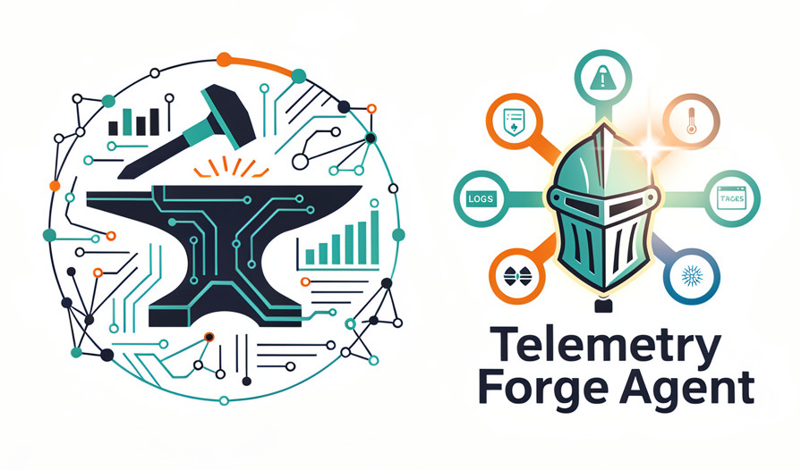

<p align="center">
  
</p>

<p align="center">
  <a href="https://docs.telemetryforge.io"></a>
  <a href="LICENSE"></a>
  <a href="https://github.com/telemetryforge/agent/releases"></a>
  <a href="https://telemetry.io/support"></a>
  <a href="https://join.slack.com/share/enQtOTU4MDk0MTQ0OTYzNi03MTY5MTc2Y2I0Y2JhY2QxNzc5MDNkNDdhNTRhNTgzNjkwMDc4Mzk1YTRhZWUzNTE4ZjM3OTljOTA4MzAxYjBl"></a>
</p>

## What is the [Telemetry Forge](https://telemetryforge.io) Agent?

The [Telemetry Forge](https://telemetryforge.io) Agent is a **hardened, stable, secure by default, OSS (Apache-licensed) downstream distribution of Fluent Bit** with predictable releases and long-term supported versions for 24 months.

It also has built-in functionality for:

1. Native de-duplication (Reduce log volume)
2. Native log sampling (Reduce log volume)
3. AI processors for routing (Smart log routing)
4. Enhanced storage layer (Efficient buffering)

## Support & Lifecycle

### Version Support Matrix

| Version | Release Date | Type | End of Support | Status | Branch |
| ------- | ------------ | ---- | -------------- | ------ | ------ |
| **[26.10](https://github.com/orgs/telemetryforge/projects/4)** | Oct 2026 | LTS | Oct 2028 | 🟡 Planned | |
| **[26.04](https://github.com/orgs/telemetryforge/projects/4)** | Apr 2026 | LTS | Apr 2028 | 🟢 Active | `main` |
| **[25.10](https://github.com/orgs/telemetryforge/projects/3)** | Oct 2025 | LTS | Oct 2027 | 🟢 Active | `release/25.10-lts` |
| 25.07 | Jul 2025 | Regular | Jan 2026 | 🟢 Active | |

Main releases follow a date-based format with `Year.Month.Week` forming the version.
Once it transitions to an LTS release then we maintain the major and minor versions from then on, only incrementing the patch version.

### Release Schedule

| Release Type | Frequency | Description |
| ------------ | --------- | ----------- |
| **LTS Release** | Twice yearly (April, October) | Long-term support for 24 months |
| **Regular Release** | Quarterly | 6-month support cycle |
| **Security Updates** | Weekly | CVE patches and critical fixes |
| **Patch Release** | As needed | Bug fixes and minor updates |
| **Main Builds** | Weekly | Latest development builds from main branch |

---

### Why use our agent?

- ✅ **Smaller footprint** - Optimized for production deployments
  - Only production-essential plugins included
  - Size-focused builds with dead code elimination
  - IPO/LTO interprocedural optimization

- ✅ **Security-hardened by default** - Enterprise-grade security
  - FORTIFY_SOURCE and stack protection enabled
  - 17 vendor-specific plugins disabled by default
  - All remote interfaces disabled, authentication required
  - FIPS-compliant builds with OpenSSL in FIPS mode

- ✅ **24-month LTS support** - Predictable and reliable
  - Weekly security patches and CVE fixes
  - Quarterly releases with long-term stability
  - Daily security scans and vulnerability reporting

- ✅ **Advanced features** - Production-ready capabilities
  - Performant log deduplication - reduce costs by up to 40%
  - Log sampling processor for high-volume environments
  - AI-based filtering and routing
  - Native flattening for OpenSearch/Elasticsearch
  - Type safety with automatic conflict resolution

- ✅ **Battle-tested quality** - Continuous validation
  - Full integration and regression testing suite
  - Memory safety validation with Valgrind/AddressSanitizer
  - Performance benchmarks and regression testing

[Learn more about features →](https://docs.telemetryforge.io/features)

---

## Quick Start

### Docker

```bash
docker run --rm -it -v /var/log/containers:/var/log/containers:ro ghcr.io/telemetryforge/agent/ubi:main -c /fluent-bit/etc/fluent-bit.yaml
docker run --rm -it -v /var/log/containers:/var/log/containers:ro ghcr.io/telemetryforge/agent/debian:main -c /fluent-bit/etc/fluent-bit.yaml
```

Ensure any files mounted are readable via the container user ([`cat Dockerfile.ubi|grep USER`](./Dockerfile.ubi)).

To specify a different configuration just mount it in as well and pass it on the command line to use.

### Package Installation

All packages are available for download at <https://packages.telemetryforge.io>.

Linux and macOS packages are available for download and installation or using a simple install script:

```bash
curl -sSfL https://raw.githubusercontent.com/telemetryforge/agent/refs/heads/main/install.sh | bash
```

Windows packages are also available for download in various formats (ZIP, EXE or MSI).

### Building from Source

To compile for a specific target, run the container-based build using the upstream [`source/packaging/build.sh`](./source/packaging/build.sh) script with the specified distribution you want to build for:

```bash
git clone https://github.com/telemetryforge/agent.git
cd agent
./source/packaging/build.sh -d rockylinux/9
```

To build the UBI or distroless containers:

```bash
git clone https://github.com/telemetryforge/agent.git
cd agent
docker build -f Dockerfile.ubi .
docker build -f Dockerfile.debian .
```

To compile natively (requires relevant dependencies installed):

```bash
git clone https://github.com/telemetryforge/agent.git
cd agent
cd source/build
cmake ..
make
```

[Refer to the CI](./.github/workflows/README.md) for full examples of different target builds:

- [Container builds](./.github/workflows/call-build-containers.yaml)
- [Linux builds](./.github/workflows/call-build-linux-packages.yaml)
- [Windows builds](./.github/workflows/call-build-windows-packages.yaml)

---

## Resources

- **[Documentation](https://docs.telemetryforge.io)** - Complete documentation and guides
- **[Downloads](https://packages.telemetryforge.io)** - Pre-built packages and containers
- **[Release Notes](https://github.com/telemetryforge/agent/releases)** - Version history and changelogs
- **[OSS Fluent Bit Docs](https://docs.fluentbit.io)** - Core documentation reference

---

## Community & Support

- **[Slack](https://join.slack.com/share/enQtOTU4MDk0MTQ0OTYzNi03MTY5MTc2Y2I0Y2JhY2QxNzc5MDNkNDdhNTRhNTgzNjkwMDc4Mzk1YTRhZWUzNTE4ZjM3OTljOTA4MzAxYjBl)** - Join our community chat
- **[GitHub Issues](https://github.com/telemetryforge/agent/issues)** - Bug reports and feature requests
- **[Contributing Guide](CONTRIBUTING.md)** - How to contribute to the project
- **[Commercial Support](https://telemetryforge.io)** - Enterprise support with SLA

---

## Security

The Cosign key for our images is [provided](./cosign.pub) in this repo.

Follow the documentation to verify against it: <https://docs.sigstore.dev/cosign/verifying/verify/>.

The GPG key is also [provided](./gpg.pub) that signs packages and checksums.

### Reporting Security Issues

If you discover a potential security issue, **DO NOT** create a public GitHub issue. Instead, report it directly:

📧 **Email**: [security@telemetryforge.io](mailto:security@telemetryforge.io)

Please include:

- Description of the vulnerability
- Steps to reproduce
- Potential impact
- Suggested fixes (if any)

We follow responsible disclosure and will work with you to address issues promptly.

---

## License

This project is licensed under the [Apache License 2.0](LICENSE).

## Copyright

Copyright © [Telemetry Forge](https://telemetryforge.io) Contributors. See [NOTICE](NOTICE) for details.

## Acknowledgments

Our agent is built on top of [Fluent Bit](https://fluentbit.io).
We are grateful to the Fluent Bit community and all contributors who make this possible ❤️

---

<p align="center">
  <a href="https://telemetryforge.io">Website</a> •
  <a href="https://docs.telemetryforge.io">Docs</a> •
  <a href="https://twitter.com/telemetryforge">Twitter</a> •
  <a href="https://telemetryforge.io">Support</a>
</p>
